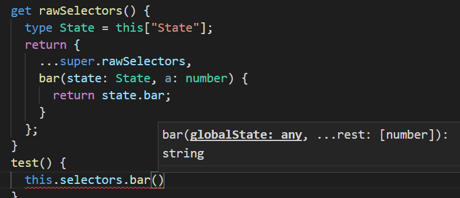

# saga-duck
extensible and composable duck for redux-saga, typescript 3.x supported.

See also
[ducks-modular-redux](https://github.com/erikras/ducks-modular-redux)
[extensible-duck](https://github.com/investtools/extensible-duck)

# example


# usage
## install
```sh
npm i saga-duck -S
```

## Documents
[Document-中文](https://cyrilluce.gitbook.io/saga-duck/)

for 2.x please visit
[Legacy Document-中文](https://cyrilluce.gitbooks.io/saga-duck)


## memtion
Ducks should be stateless, so we can use React FSC(functional stateless compoment) and optimize later.
You should only access store by duck.selector or duck.selectors.

## single duck
```js
import { Duck } from "saga-duck";
import { takeEvery, call, put, select } from "redux-saga/effects";
import { delay } from "redux-saga";

class SingleDuck extends Duck {
  get quickTypes() {
    return {
      ...super.quickTypes,
      INCREMENT: 1,
      INCREMENT_ASYNC: 1
    };
  }
  get reducers() {
    const { types } = this;
    return {
      ...super.reducers,
      count: (state = 0, action) => {
        switch (action.type) {
          case types.INCREMENT:
            return state + 1;
          default:
            return state;
        }
      }
    };
  }
  *saga() {
    yield* super.saga();
    const { types, selector } = this;
    yield takeEvery(types.INCREMENT_ASYNC, function*() {
      yield call(delay, 1000);
      // select state of this duck
      const { count } = selector(yield select());
      yield put({type: types.INCREMENT});
    });
  }
}
```

## extend duck
```js
class ExtendedDuck extends SingleDuck {
  get quickTypes(){
    return {
      ...super.quickTypes,
      MORE: 1
    }
  }
  get reducers(){
    return {
      ...super.reducers,
      more: (state, action) => 1
    }
  }
  get rawSelectors(){
    return {
      ...super.rawSelectors,
      more(state){
        return state.more
      }
    }
  }
  get creators(){
    const { types } = this
    return {
      ...super.creators,
      more(){
        return {
          type: types.MORE
        }
      }
    }
  }
  *saga(){
    yield* super.saga()
    const { types, selector, selectors, creators } = this
    yield take([types.INCREMENT, types.MORE])
    const { count, more } = selector(yield select())
    const _more = selectors.more(yield select())
    yield put(creators.more())
  }
}
```

## compose ducks
```js
import { ComposableDuck } from "saga-duck";

class ComposedDuck extends ComposableDuck {
  get quickTypes() {
    return {
      ...super.quickTypes,
      PARENT: 1
    };
  }
  get quickDucks() {
    return {
      ...super.quickDucks,
      duck1: SingleDuck,
      duck2: ExtendedDuck,
      duck3: ExtendedDuck
    };
  }
  *saga() {
    yield* super.saga();
    const {
      types,
      selector,
      ducks: { duck1, duck2, duck3 }
    } = this;
    yield takeEvery(types.PARENT, function*() {
      yield put({ type: duck1.types.INCREMENT });
      yield put(duck2.creators.more());
      yield put(duck3.creators.more());
    });
    // { parent, duck1: {count}, duck2: {count, more}, duck3: {count, more} }
    const state = selector(yield select());
  }
}
```

## Run and connect to React
```js
import { DuckRuntime } from "saga-duck";
import Root from "./Root";
import Duck from "./RootDuck";

const duckRuntime = new DuckRuntime(new Duck({...}));
const ConnectedComponent = duckRuntime.connectRoot()(Root);

ReactDOM.render(
  <Provider store={duckRuntime.store}>
    <ConnectedComponent />
  </Provider>,
  document.getElementById("root")
);
```

## Helpers
### purify
make React DuckComponent pure, only rerender when props and duck state changed.
```javascript
import { purify } from 'saga-duck'
export default purify(function DuckComponent({ duck, store, dispatch }){ ... })
```

### memorize
stabilize objects/functions reference, prevent React props unnecessary change.
```javascript
import { memorize } from 'saga-duck'
const getHandler = memorize((duck, dispatch) => ()=>dispatch(duck.creators.bar()) )

function Container(props){
  const handler = gethandler(props)
  return <Foo handler={handler} />
}
```

### reduceFromPayload / createToPayload
Create simple reducer / actionCreator
```javascript
import { reduceFromPayload, createToPayload } from 'saga-duck'

let reducer = reduceFromPayload(types.SET_ID, 0)
// equal to 
reducer = (state=0, action)=>{
  switch(action.type){
    case types.SET_ID:
      return action.payload
    default:
      return state
  }
}

let creator = createToPayload<number>(types.SET_ID)
// equal to
creator = (id)=>({ type: types.SET_ID, payload: id })
```

## Typescript support
See [Duck example](./examples/src/CounterDuck.ts) and [DuckMap example](./examples/src/RootDuck.ts), please use typescript **3.0+** for saga-duck 3.x, and typescript 2.6.1 for saga-duck 2.x.
### types


### state (generate from reducers)


### selectors
